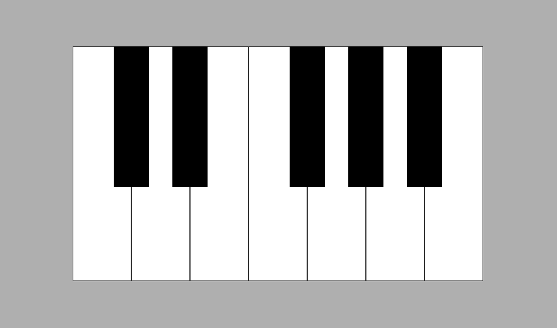

# Piano
🎹 Um simples piano desenvolvido utilizando HTML, CSS, JavaScript. Para relaxar e passar o tempo.

### [Demonstração](https://zzeris.github.io/piano/)



## Teclas de atalho

### Teclas pretas
```
W - E - R - T - Y
```

### Teclas brancas
```
A - S - D - F - G - H - J
```

## Autor

| [<br><sub>@Zzeris</sub>](https://github.com/Zzeris) |
| :---: |
